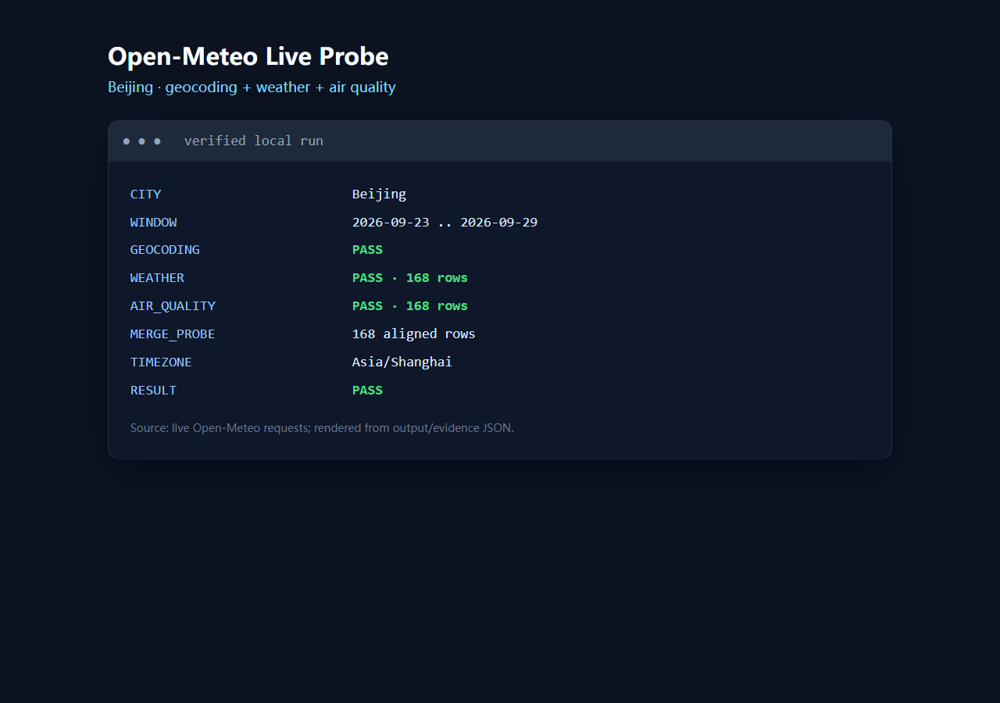
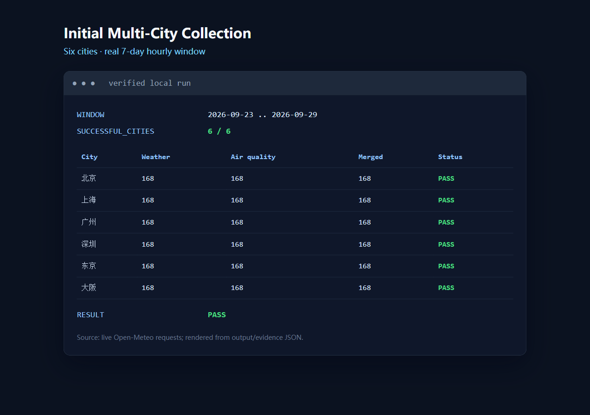
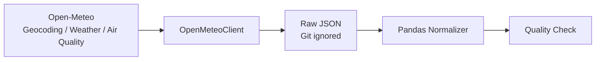

# Urban Environment Analytics Platform

基于 Python 构建的多城市环境数据采集与分析平台，通过公开天气与空气质量 API 获取时序数据，为后续数据清洗、质量检查、统计分析与可视化提供统一数据基础。

> 当前仓库完成 Phase 0–1：工程初始化、数据源验证、首批真实采集、最小标准化、基础质量检查与离线自动化测试。数据库持久化、分析模块、Dashboard 和自动调度属于后续路线，尚未实现。

## 项目背景

城市天气与空气质量数据具有多城市、时间序列和字段结构差异等特点。本项目从可靠、可测试的公共 API 客户端开始，逐步建立采集、原始数据留存、标准化和质量控制的数据管道。

## 当前功能

- 经 Open-Meteo Geocoding API 验证的 6 城市配置
- Historical Weather 与 Air Quality 小窗口真实采集
- 集中的 HTTPX 客户端、连接/读取超时、状态和 JSON 校验
- 网络异常与 5xx 的有限指数退避重试
- 按日期/城市保留 Raw JSON（本地保存、Git 忽略）
- 天气与空气质量 DataFrame 标准化
- `city + timestamp` 对齐合并 probe
- 行数、字段、时间戳、空值、重复和数值转换质量检查
- 18 个不依赖互联网的 pytest 测试

## 数据源

- [Open-Meteo](https://open-meteo.com/)：天气、空气质量和地理编码公共 API

数据使用需遵循 Open-Meteo 及其上游数据提供方的署名要求。

详细的接口、字段、限制和实际验证结果见 [数据源核验记录](docs/development/data-source-verification.md)。空气质量来自 CAMS 数据，使用时也应向 CAMS 数据提供方署名。

## 真实采集证据

### 北京数据源 Probe



### 六城市首次采集



2026-09-30 的首次运行采集了 2026-09-23 至 2026-09-29：北京、上海、广州、深圳、东京、大阪的天气和空气质量各 168 行。Raw 数据没有进入 Git；仓库仅保留北京响应裁剪出的 3 个时间点样例。

## 当前数据流程



架构边界和后续能力标识见 [Phase 1 数据管道](docs/architecture/data-pipeline.md)。

## 快速开始

```powershell
python -m venv .venv
.\.venv\Scripts\Activate.ps1
python -m pip install --index-url https://pypi.org/simple -r requirements.txt
python -m pip install --no-build-isolation -e .
python -m pytest -v
python scripts/probe_open_meteo.py
python scripts/collect_initial_data.py
```

最后两个命令会访问真实网络。pytest 使用 HTTPX MockTransport，不依赖 Open-Meteo 在线状态。

## 数据字段

| 数据集 | Open-Meteo 字段 | 标准化字段 |
|---|---|---|
| Weather | `time` | `timestamp` |
| Weather | `temperature_2m` | `temperature` |
| Weather | `relative_humidity_2m` | `relative_humidity` |
| Weather | `precipitation` | `precipitation` |
| Weather | `wind_speed_10m` | `wind_speed` |
| Weather | `surface_pressure` | `surface_pressure` |
| Air quality | `pm2_5`, `pm10` | `pm2_5`, `pm10` |
| Air quality | `nitrogen_dioxide`, `ozone` | 同名 snake_case 字段 |
| Air quality | `european_aqi` | `air_quality_index` |

`european_aqi` 是统一采用的指数定义，不表示东京或中国城市使用欧洲区域模型；Open-Meteo 会在全球范围使用可用 CAMS 域。

## 自动化测试

```text
18 passed
```

覆盖 geocoding、天气、空气质量、timeout、4xx/5xx、invalid JSON、缺字段、retry/backoff、normalization、merge 和 quality check。

## 项目结构

```text
src/urban_environment/   核心采集、处理与质量检查代码
scripts/                 真实网络 probe 与首次采集入口
config/                  经地理编码验证的城市配置
data/raw/                本地原始响应（Git 忽略）
data/processed/          本地处理结果（Git 忽略）
data/samples/            可提交的小型公共数据样例
tests/                   不依赖互联网的自动化测试
docs/                    架构、数据源和开发记录
```

## 工程决策

- 使用 JSON 城市配置，避免为 6 条静态记录增加 YAML 依赖。
- 网络调用集中在一个 client，采集脚本只负责流程编排和逐城市隔离失败。
- Raw 层不修改 API 内容；标准化与质量检查是独立、可测试的纯数据步骤。
- 每次只拉取约 7 天数据，确保 Phase 1 验证真实且克制。
- `european_aqi` 明确映射为内部 `air_quality_index`，避免隐藏指数标准。

## 后续扩展

Phase 2 以后再评估 ETL、SQLite/PostgreSQL、增量同步、数据质量报告、统计分析、Streamlit、调度和 GitHub Actions。

开发过程、真实问题与遗留边界见 [Phase 01 开发记录](docs/development/phase-01-data-collection.md)。

## License

项目代码采用 [MIT License](LICENSE)。Open-Meteo 数据受其数据源许可和署名条款约束。
