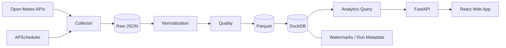

# Urban Environment Analytics Platform

面向多城市天气与空气质量数据的采集、处理与分析平台。系统持续获取公共环境数据，通过标准化、质量检查和增量 ETL 构建 Parquet / DuckDB 分析层，并由 FastAPI 与 React Web 应用提供城市环境概览、趋势分析、多城市比较、数据质量和管道运行状态。


## 核心能力

- 北京、上海、广州、深圳、东京和大阪六城小时级环境观测
- Open-Meteo Geocoding、Historical Weather 与 Air Quality API 统一采集客户端
- Raw JSON、分区 Parquet、DuckDB 三层数据架构
- UTC 标准时间与城市 IANA timezone 并存
- `city + timestamp` 幂等写入、重复跳过与数据集独立 watermark
- Schema、完整性、重复、时间连续性、数值转换和范围质量检查
- 日统计、24h / 7d rolling mean、城市比较、相关性探索和 IQR 异常标记
- APScheduler 增量任务、跨进程文件锁与采集运行台账
- FastAPI 只读 Analytics API 与 React / TypeScript 多页面应用
- Python 与前端离线自动化测试、GitHub Actions 持续集成

## Web 应用

真实路由支持直接访问、刷新、浏览器前进与后退：

- `/overview`：城市天气 Hero、六城快捷观测、环境地图和管道脉搏
- `/cities/:city`：单城气象与空气质量时间序列
- `/compare`：统一时间窗口下的城市指标比较与地图视图
- `/quality`：质量结论、检查矩阵、覆盖率与运行历史
- `/pipeline`：从 Open-Meteo 到 Analytics 的节点状态、水位和采集台账
- `/about`：系统架构、数据来源与技术构成

| 城市详情 | 数据管道 |
|---|---|
|  |  |

更多界面：[城市比较](docs/images/web-comparison.png) · [数据质量](docs/images/web-data-quality.png) · [东京详情](docs/images/web-city-tokyo.png) · [系统介绍](docs/images/web-about.png)

## 系统架构



详细设计见 [数据平台架构](docs/architecture/final-data-platform.md)、[存储设计](docs/architecture/storage-design.md) 和 [Web 设计系统](docs/design/design-system.md)。

## 数据管道

1. Collector 按城市、数据集和日期窗口请求 Open-Meteo。
2. 原始响应按运行日期保存在 `data/raw/`，不进入 Git。
3. Normalizer 将本地时间统一为 UTC，并写入来源与摄取元数据。
4. Quality 模块输出 PASS / WARN / FAIL 报告，异常记录保留供追踪。
5. Clean 数据按 `dataset/city/year/month` 写入 Parquet。
6. DuckDB 暴露 `weather_clean`、`air_quality_clean`、`environment_hourly` 和 `city_daily_summary`。
7. FastAPI 通过只读查询层向 Web 应用提供结构化响应。

当前验证窗口包含 1,008 条六城联合小时观测；相同日期回放拉取 2,016 条天气与空气质量记录，写入 0 条并跳过 2,016 条重复记录。

## 数据字段

天气：`temperature`、`relative_humidity`、`precipitation`、`wind_speed`、`surface_pressure`、`weather_code`。

空气质量：`pm2_5`、`pm10`、`nitrogen_dioxide`、`ozone`、`air_quality_index`。AQI 使用 Open-Meteo 返回的 European AQI。

共同字段：`city`、`country`、`timestamp`、`timezone`、`source`、`ingested_at`。Clean 层时间统一为 UTC。

## 快速开始

```powershell
python -m venv .venv
.\.venv\Scripts\Activate.ps1
python -m pip install -r requirements.txt
python -m pip install --no-build-isolation -e .

cd frontend
npm install
npm run build
cd ..

python -m uvicorn urban_environment.web.app:app --host 127.0.0.1 --port 8000
```

浏览器访问 `http://127.0.0.1:8000/`。开发前端可在 `frontend/` 中执行 `npm run dev`，请求将代理到 8000 端口。

采集与调度：

```powershell
python -m urban_environment.pipeline collect --all-cities
python -m urban_environment.pipeline collect --city beijing
python -m urban_environment.pipeline scheduler
```

## 测试

```powershell
python -m pytest -v
cd frontend
npm run typecheck
npm test
npm run build
```

Python 测试使用 HTTPX `MockTransport` 和 pytest 临时目录，不访问真实 API 或开发数据库。前端测试覆盖路由恢复、WMO 天气状态、缺失值和 European AQI 分级。CI 同时执行 Python compile / pytest 与前端 typecheck / test / build。

## 项目结构

```text
config/                         六城市配置
data/raw/                       原始 API 响应（Git ignored）
data/processed/                 分区 Parquet（Git ignored）
data/analytics/                 DuckDB（Git ignored）
frontend/                       React + Vite + TypeScript Web 应用
src/urban_environment/
  collectors/                   Open-Meteo client
  processing/                   UTC normalization
  quality/                      数据质量检查
  storage/                      Parquet + DuckDB
  analytics/                    聚合、rolling、相关性与异常
  web/                          FastAPI 与只读查询层
  pipeline.py                   增量 ETL CLI
  scheduler.py                  APScheduler + lock
tests/                          Python 离线测试
docs/                           架构、设计决策、开发记录和截图
```

## 工程决策

- DuckDB 直接查询 Parquet，保持本地分析环境轻量且可移植。
- Parquet 按城市、年、月分区，在六城市小时粒度下平衡可读性与文件数量。
- 采集状态按 city / dataset 隔离，单个请求失败不会回滚其他成功结果。
- Analytics API 只读，采集和转换由 pipeline 独立执行。
- 气象与空气质量保持各自量纲，图表不将不同单位机械叠加到同一坐标轴。
- Web 端以真实观测时间为准，不把历史最新记录描述为实时天气。

## 数据来源与许可

环境数据来自 [Open-Meteo](https://open-meteo.com/)，空气质量使用 CAMS 数据；地图使用 [OpenStreetMap](https://www.openstreetmap.org/copyright) 瓦片并保留署名。第三方界面依赖见 [UI 资产与许可](docs/design/third-party-ui.md)。

项目代码采用 [MIT License](LICENSE)。
