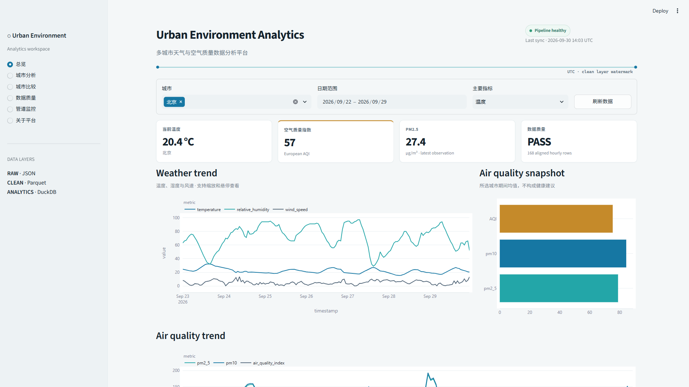
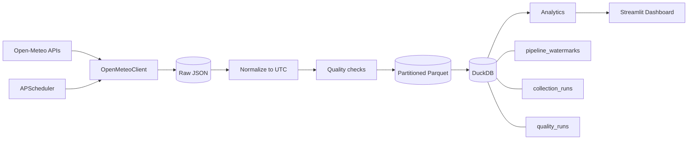
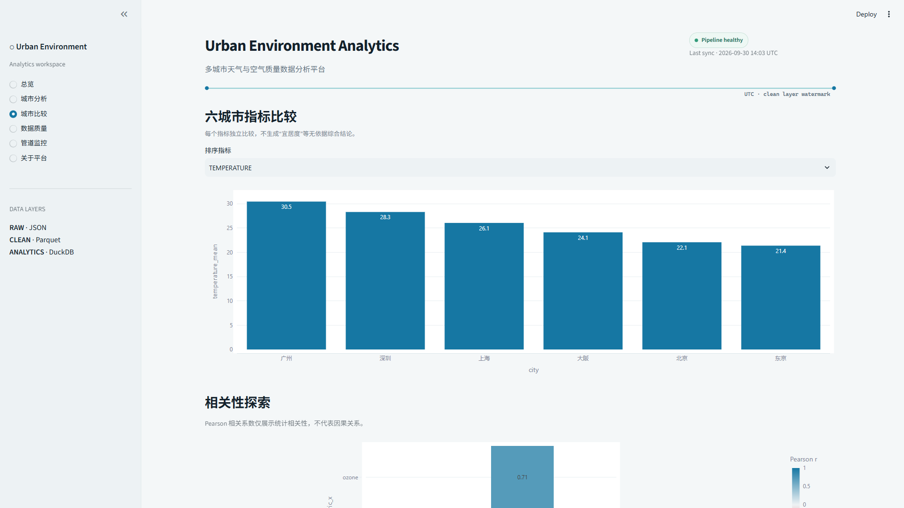
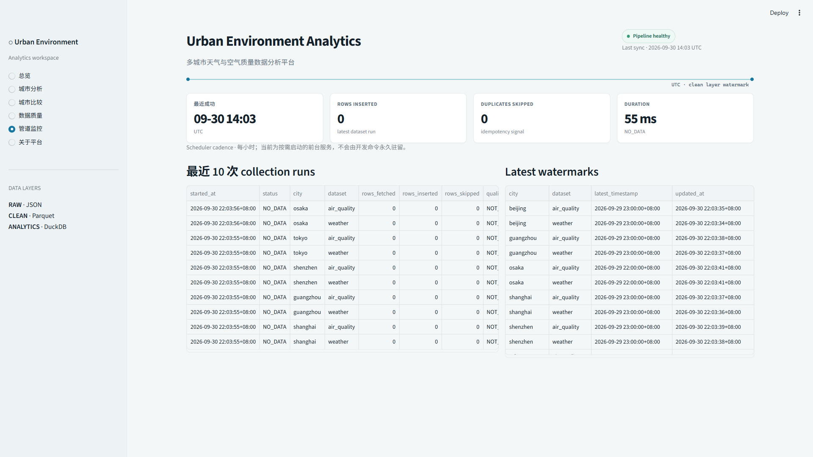

# Urban Environment Analytics Platform

基于 Python 构建的多城市环境数据工程与分析平台，实现公开环境数据的自动采集、增量 ETL、质量检查、分析存储、调度与可视化。



## 项目背景

天气与空气质量数据来自不同接口，具有多城市、跨时区、字段结构差异、重复采集和外部服务不稳定等问题。本项目围绕北京、上海、广州、深圳、东京和大阪，建立一条从公共 API 到交互式分析界面的完整本地数据管道。

平台不依赖 AI，也不把 Raw JSON 直接交给界面。所有分析都来自经标准化、质量检查和幂等写入后的 Clean / Analytics 层。

## 核心能力

- Open-Meteo Geocoding、Historical Weather 和 Air Quality 统一 HTTPX 客户端
- Raw JSON、分区 Parquet、DuckDB 三层数据架构
- 统一 UTC 时间，同时保留城市 IANA timezone
- `city + timestamp` 逻辑键幂等写入和重复跳过
- 按 `city + dataset` 独立维护 watermark
- `collection_runs`、`quality_runs` 和错误摘要
- Schema、空值、重复、时间缺口、数值转换和保守范围检查
- 日统计、24h/7d rolling mean、城市比较、Pearson 相关性探索、IQR 异常标记
- APScheduler 每小时增量任务与跨进程文件锁
- Streamlit + Plotly 多页面 Dashboard
- 53 个离线 pytest 测试与 GitHub Actions CI

## 系统架构



详细说明见 [最终平台架构](docs/architecture/final-data-platform.md) 和 [存储设计](docs/architecture/storage-design.md)。

## 数据管道

1. Collector 按城市、数据集和日期窗口调用 Open-Meteo。
2. API 原始响应按运行日期写入 `data/raw/`，该目录不进入 Git。
3. Normalizer 将本地时间转换为 UTC，并加入 `country`、`timezone`、`source`、`ingested_at`。
4. Quality 模块生成 PASS / WARN / FAIL 报告，但不自动删除异常记录。
5. Clean 数据按 `dataset/city/year/month` 写入 Parquet。
6. DuckDB 暴露 `weather_clean`、`air_quality_clean`、`environment_hourly` 和 `city_daily_summary`。
7. Watermark 决定下一次默认请求窗口；显式日期窗口可用于回放和幂等验证。

首次真实运行写入 2,016 条 Clean 记录；相同窗口再次运行插入 0 条、跳过 2,016 条。默认增量执行随后返回 `NO_DATA`，证明 watermark 已到当前完整日期末端。

## 数据模型

天气字段：`city`、`country`、`timestamp`、`timezone`、`temperature`、`relative_humidity`、`precipitation`、`wind_speed`、`surface_pressure`、`source`、`ingested_at`。

空气质量字段：`city`、`country`、`timestamp`、`timezone`、`pm2_5`、`pm10`、`nitrogen_dioxide`、`ozone`、`air_quality_index`、`source`、`ingested_at`。

`timestamp` 在 Clean 层统一为 UTC；`timezone` 用于恢复城市当地时间。空气质量指数采用 Open-Meteo 返回的 European AQI 定义。

## Dashboard

页面包括：Overview、City Analysis、City Comparison、Data Quality、Pipeline Monitor 和 About。





其余真实界面证据位于 `docs/images/`。Dashboard 只查询 DuckDB，不在 rerun 时扫描 Raw JSON。

## 分析能力

- 小时原始粒度与城市当地日期的日聚合
- 温度、湿度、风速、PM2.5、PM10、AQI 的 mean / min / max
- 24 小时和 7 天滚动平均
- 六城市单指标比较与排序
- PM2.5–风速/湿度/降水、O₃–温度的 Pearson 相关性探索
- 温度、PM2.5、AQI 的 IQR 异常事件标记

相关性仅用于统计探索，不代表因果关系；异常记录只标记、不删除。

## Data Quality

每次成功标准化都会检查：必需字段、行数、空值率、重复率、时间单调性、小时缺口、数值转换失败和保守合理范围。报告写入本地 `data/reports/`，摘要进入 DuckDB `quality_runs`。

## 自动化测试

```text
53 passed
```

主测试套件完全离线，使用 HTTPX `MockTransport` 和 pytest 临时目录，覆盖 API 错误、Parquet、DuckDB、watermark、幂等回放、collection runs、质量检查、聚合、rolling、相关性、异常、scheduler lock 和 Dashboard 查询。

GitHub Actions 在 push / pull request 时使用 Python 3.13 执行 compile check 与完整 pytest，不访问真实 Open-Meteo。

## 快速开始

```powershell
python -m venv .venv
.\.venv\Scripts\Activate.ps1
python -m pip install --index-url https://pypi.org/simple -r requirements.txt
python -m pip install --no-build-isolation -e .
python -m pytest -v
```

首次或默认增量采集：

```powershell
python -m urban_environment.pipeline collect --all-cities
python -m urban_environment.pipeline collect --city beijing
```

显式窗口回放：

```powershell
python -m urban_environment.pipeline collect --all-cities --start 2026-09-23 --end 2026-09-29
```

Dashboard：

```powershell
streamlit run src/urban_environment/dashboard/app.py
```

前台 scheduler（每小时；按需启动）：

```powershell
python -m urban_environment.pipeline scheduler
```

## 项目结构

```text
config/                         城市配置
data/raw/                       原始 API 响应，Git ignored
data/processed/                 分区 Parquet，Git ignored
data/analytics/                 DuckDB，Git ignored
data/reports/                   质量/管道报告，Git ignored
src/urban_environment/
  collectors/                   Open-Meteo client
  processing/                   UTC normalization
  quality/                      质量检查
  storage/                      Parquet + DuckDB
  analytics/                    统计、rolling、相关性、异常
  dashboard/                    Streamlit 页面与查询层
  pipeline.py                   增量 ETL CLI
  scheduler.py                  APScheduler + lock
tests/                          离线自动化测试
docs/                           架构、决策、问题记录和截图
```

## 工程决策

- DuckDB 适合本地分析型项目，可直接查询 Parquet，避免安装数据库服务。
- Parquet 按城市/年/月分区，在当前六城市规模下保持可读且不过度切碎。
- 采集状态按 city/dataset 拆分，一个请求失败不会回滚其他成功城市。
- Scheduler 是前台显式服务，开发和测试不会偷偷启动常驻后台任务。
- AQI 状态色只用于 AQI 语义；普通图表保持稳定的蓝/青配色。

## 后续扩展

- 更长时间窗口的缺口补采和数据保留策略
- 对免费公共 API 限额与可用性的外部监控
- 可选的对象存储或云端分析仓库
- Dashboard 部署与访问控制

## 数据来源与许可

环境数据来自 [Open-Meteo](https://open-meteo.com/)，空气质量使用 CAMS 数据。使用数据时应遵循 Open-Meteo、CAMS 及其上游数据源的署名和许可要求。

项目代码采用 [MIT License](LICENSE)。
