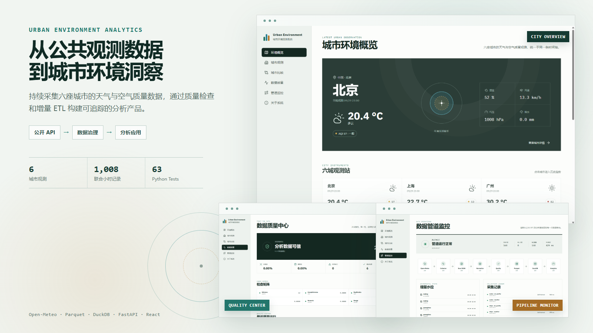
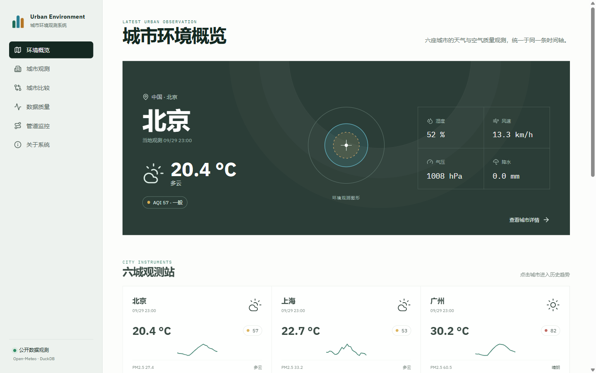
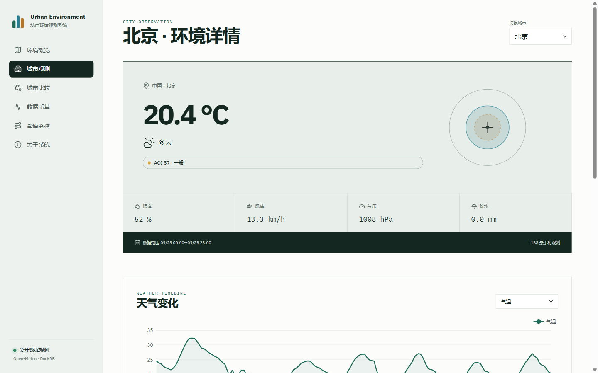
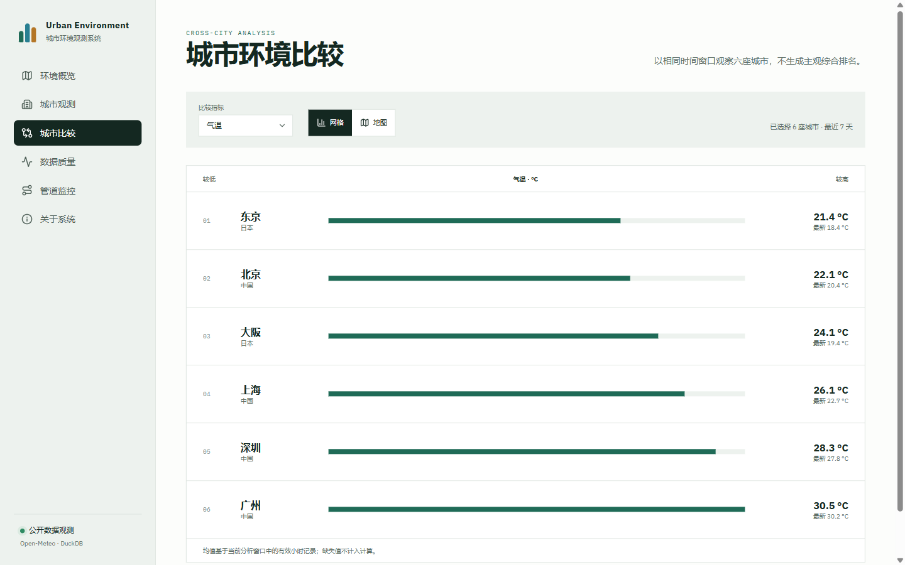
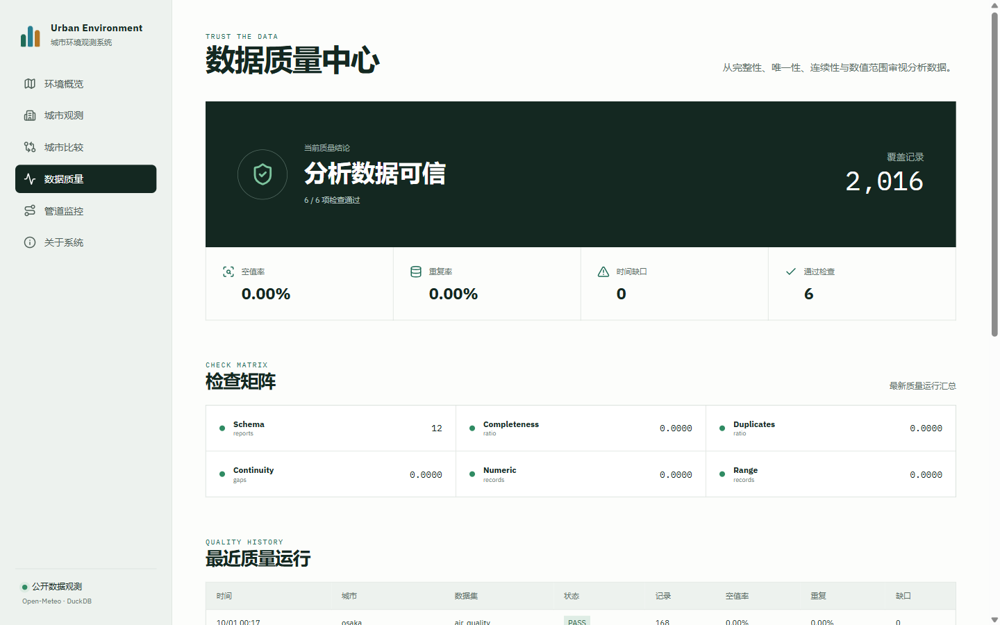
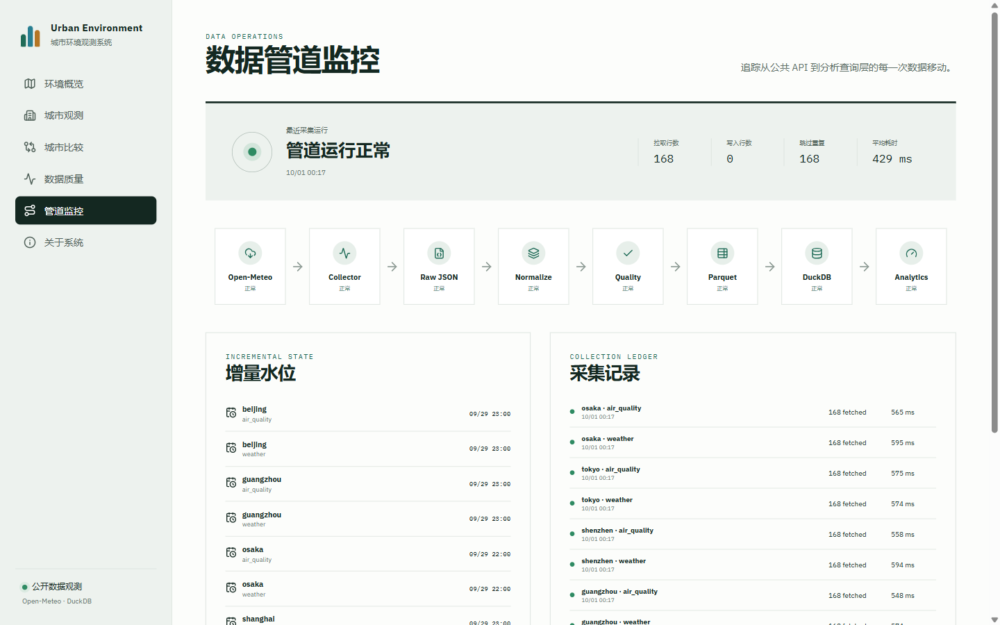
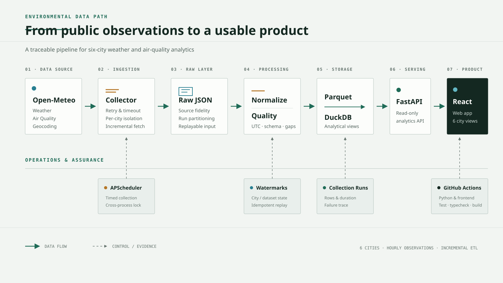

# Urban Environment Analytics Platform

面向六座城市天气与空气质量的采集、治理与分析平台，从公共观测数据构建可追踪的数据管道与产品化 Web 界面。

[](https://github.com/xuyang2005cs/urban-environment-analytics/actions/workflows/test.yml)




## 项目一览

| 指标 | 当前结果 |
|---|---:|
| 覆盖城市 | 6 |
| 联合小时观测 | 1,008 |
| Python Tests | 63 passed |
| Frontend Tests | 5 passed |
| CI | Passing |
| 幂等回放 | 2,016 / 2,016 skipped |

## 产品界面

### 城市环境概览

首页以城市当前观测为第一视觉，汇总天气、空气质量、本地时间和数据新鲜度。六城快捷卡片与环境地图提供从全局到单城分析的连续入口。

[](docs/images/web-overview.png)

### 城市观测与比较

| 北京城市详情 | 六城市比较 |
|---|---|
| [](docs/images/web-city-beijing.png) | [](docs/images/web-comparison.png) |

单城页面按量纲组织气象与污染物时间序列；比较页面在统一时间窗口下提供指标排序、小多图和地图视图。

### 数据工程能力

| 数据质量中心 | 数据管道监控 |
|---|---|
| [](docs/images/web-data-quality.png) | [](docs/images/web-pipeline.png) |

质量中心呈现 Schema、完整性、重复与连续性检查；管道监控连接采集节点、watermark、运行台账和增量写入结果。

## 系统架构



数据从 Open-Meteo 进入可回放的 Raw 层，经标准化与质量检查生成 Parquet / DuckDB 分析层，再由 FastAPI 提供给 React Web 应用。详细设计见 [数据平台架构](docs/architecture/final-data-platform.md)、[存储设计](docs/architecture/storage-design.md) 和 [Web 设计系统](docs/design/design-system.md)。

## Engineering Evidence

| 工程证据 | 验证结果 |
|---|---|
| Python 自动化测试 | ✓ 63 passed |
| 前端路由与领域逻辑测试 | ✓ 5 passed |
| GitHub Actions | ✓ Python 与前端流水线通过 |
| 公共 API 采集 | ✓ 6-city live collection |
| 增量 ETL | ✓ 2,016 / 2,016 duplicate rows skipped |
| 数据质量 | ✓ Schema、完整性、重复、连续性、数值与范围检查 |

采集探针与首次运行记录保存在 [工程证据归档](docs/images/evidence/)，界面中的 Pipeline Monitor 则持续呈现节点状态、运行耗时、写入量和去重结果。

## 技术栈

**Data & API** · Python · FastAPI · Pandas · PyArrow · Parquet · DuckDB<br>
**Web** · React · TypeScript · Vite · ECharts · Leaflet<br>
**Quality** · pytest · Vitest · GitHub Actions

## 快速开始

```powershell
python -m venv .venv
.\.venv\Scripts\Activate.ps1
python -m pip install -r requirements.txt
python -m pip install --no-build-isolation -e .

cd frontend
npm install
npm run build
cd ..

python -m uvicorn urban_environment.web.app:app --host 127.0.0.1 --port 8000
```

打开 `http://127.0.0.1:8000/`。前端开发模式在 `frontend/` 执行 `npm run dev`；数据采集可执行 `python -m urban_environment.pipeline collect --all-cities`。

## 深入阅读

- [数据管道架构](docs/architecture/final-data-platform.md)
- [存储与增量同步设计](docs/architecture/storage-design.md)
- [数据质量实现](docs/development/data-quality.md)
- [React Web 应用开发记录](docs/development/react-web-application.md)
- [问题与修复记录](docs/development/issue-log.md)

## 数据来源与许可

环境数据来自 [Open-Meteo](https://open-meteo.com/)，空气质量使用 CAMS 数据；地图使用 [OpenStreetMap](https://www.openstreetmap.org/copyright) 瓦片并保留署名。第三方界面依赖见 [UI 资产与许可](docs/design/third-party-ui.md)。

项目代码采用 [MIT License](LICENSE)。
