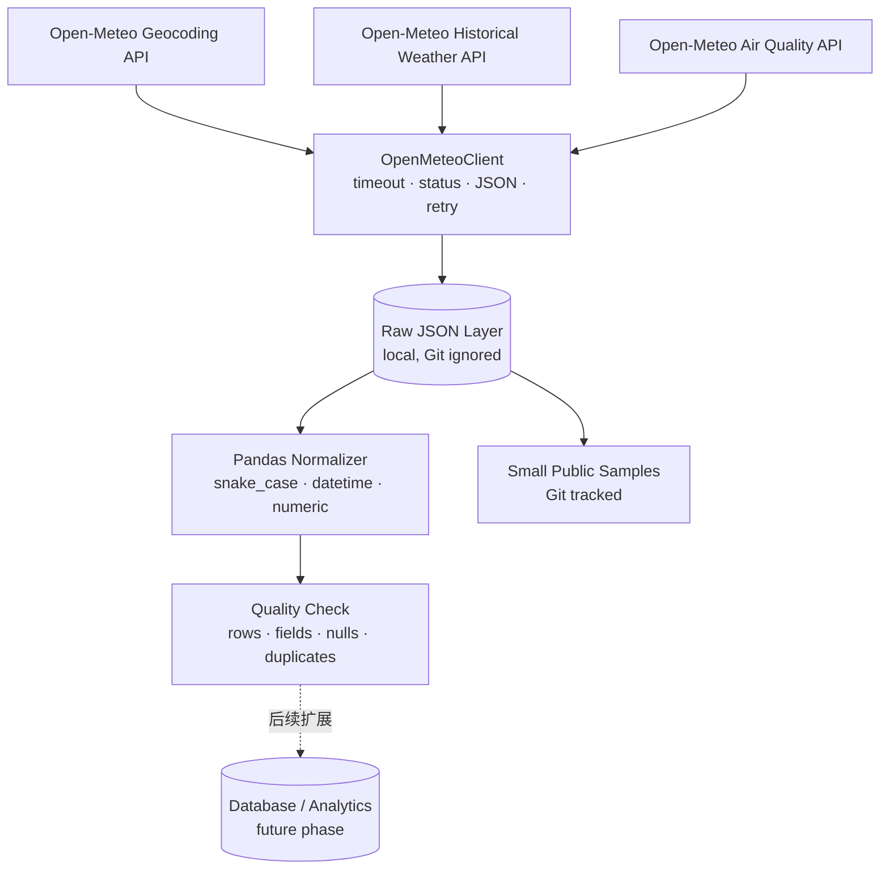

# Phase 1 数据管道

当前架构只覆盖数据源验证、采集、原始响应留存、最小标准化和基础质量检查。

## 设计边界

- 所有外部 HTTP 调用集中在 `OpenMeteoClient`，脚本不散落 `httpx.get`。
- Raw 层尽量保留 API 原始响应并按运行日期/城市/数据类型组织；大量原始数据不提交 Git。
- Normalizer 只完成字段映射、时间解析和数值转换，不插值、不填充、不聚合。
- Quality Check 返回可序列化的小型报告，当前不引入大型质量框架。
- 数据库、分析和 Dashboard 仅以虚线标注为后续能力，本阶段没有实现。

