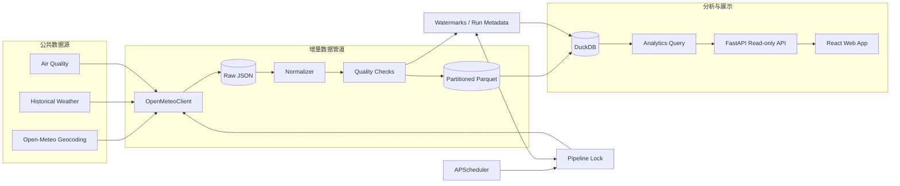

# 数据平台与 Web 应用架构

系统由数据采集管道、分析存储、只读 API 和多页面 Web 应用构成。采集与展示解耦：浏览器请求不会触发外部 API，也不会扫描 Raw JSON。

## 边界与职责

- `OpenMeteoClient` 统一处理超时、有限重试、HTTP 状态和 JSON 校验。
- Raw 层保留接近数据源的响应；生成数据不进入 Git。
- Normalizer 生成 UTC 时间戳和稳定 snake_case 表结构。
- Quality Checks 在写入 Clean 层前执行，并持久化可查询的运行摘要。
- Parquet 是可移植的 Clean 数据层；DuckDB 提供视图、元数据与分析查询。
- `AnalyticsRepository` 只读访问 DuckDB，FastAPI 使用 Pydantic 固化响应契约。
- React Router 管理真实 URL；ECharts、Leaflet 与 SVG 天气系统只消费 API 数据。

每个城市、每类数据单独记录运行结果。单个请求失败不会删除其他城市已完成的结果。调度器通过进程锁和 `max_instances=1` 防止同一工作区重叠执行。
