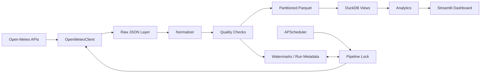

# 当前数据平台架构

当前实现保持为单机、可复现的数据工程系统，重点验证采集、分层存储、增量同步、质量控制和分析展示的完整链路。

## 边界与职责

- `OpenMeteoClient` 集中处理 HTTP 超时、有限重试、状态码和 JSON 校验。
- Raw 层保留接近原始响应的 JSON，便于追溯；生成数据不进入 Git。
- Normalizer 将小时级数组转为 UTC 时间戳和稳定的 snake_case 表结构。
- Quality Checks 在写入 Clean 层前执行，输出 PASS、WARN 或 FAIL。
- Parquet 按数据集、城市、年、月分区，是可移植的 Clean 数据层。
- DuckDB 只保存运行元数据并通过视图查询 Parquet，避免复制分析数据。
- Dashboard 只读取 DuckDB，不调用外部 API，不承担采集或转换逻辑。

每个城市、每类数据单独记录运行结果。单个请求失败不会删除其他城市已经成功写入的数据。调度器使用进程锁和 `max_instances=1` 防止同一工作区内的重叠执行。
